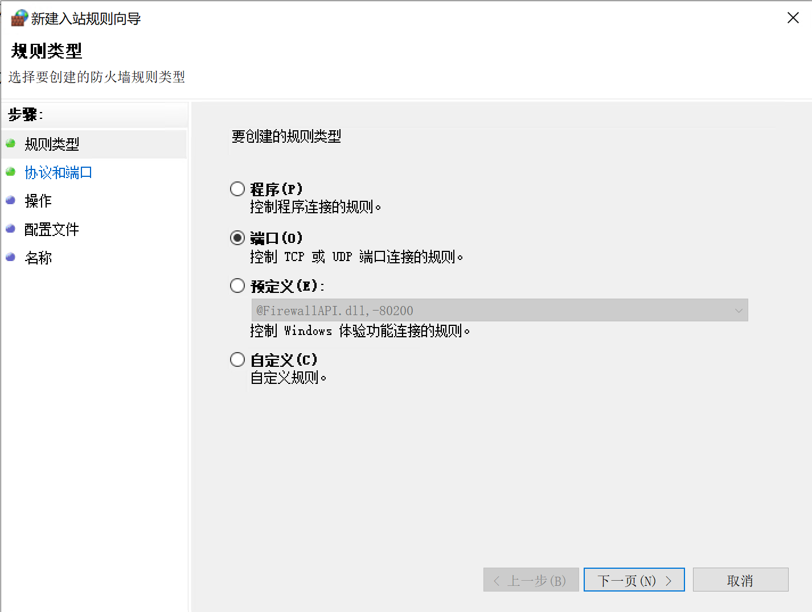
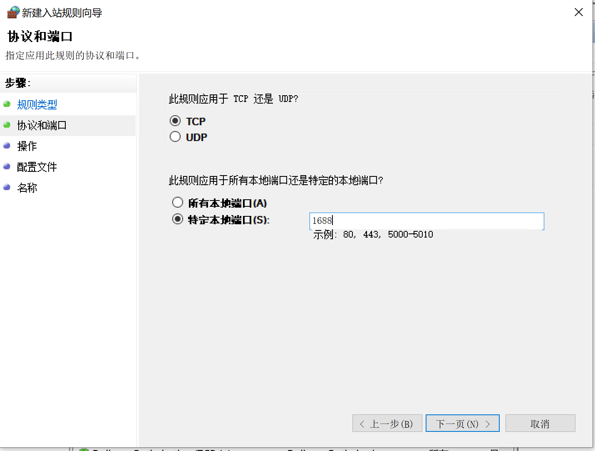
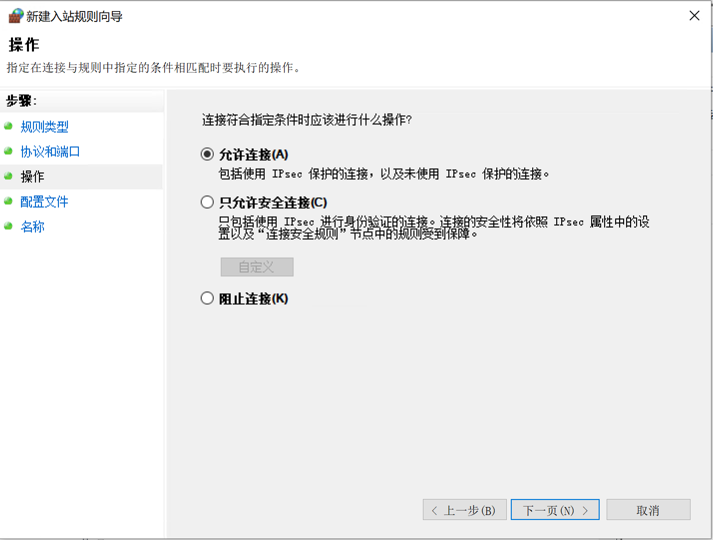
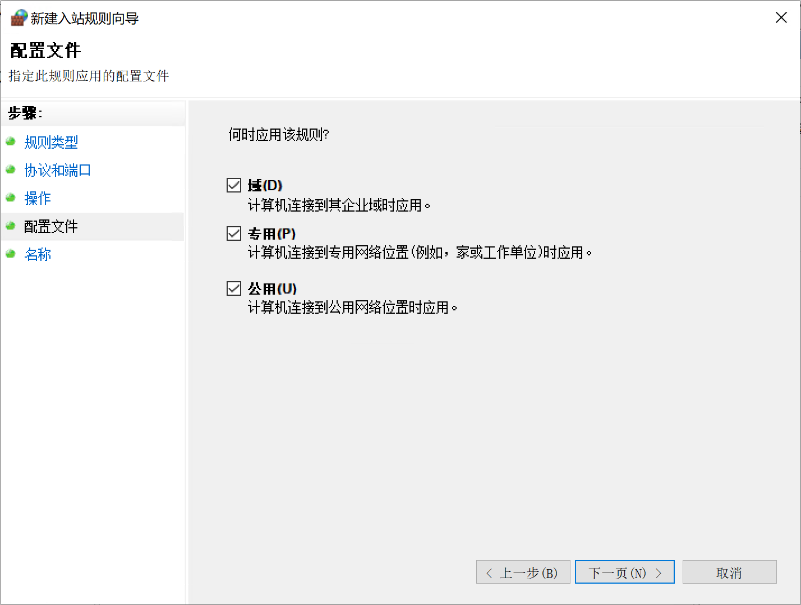
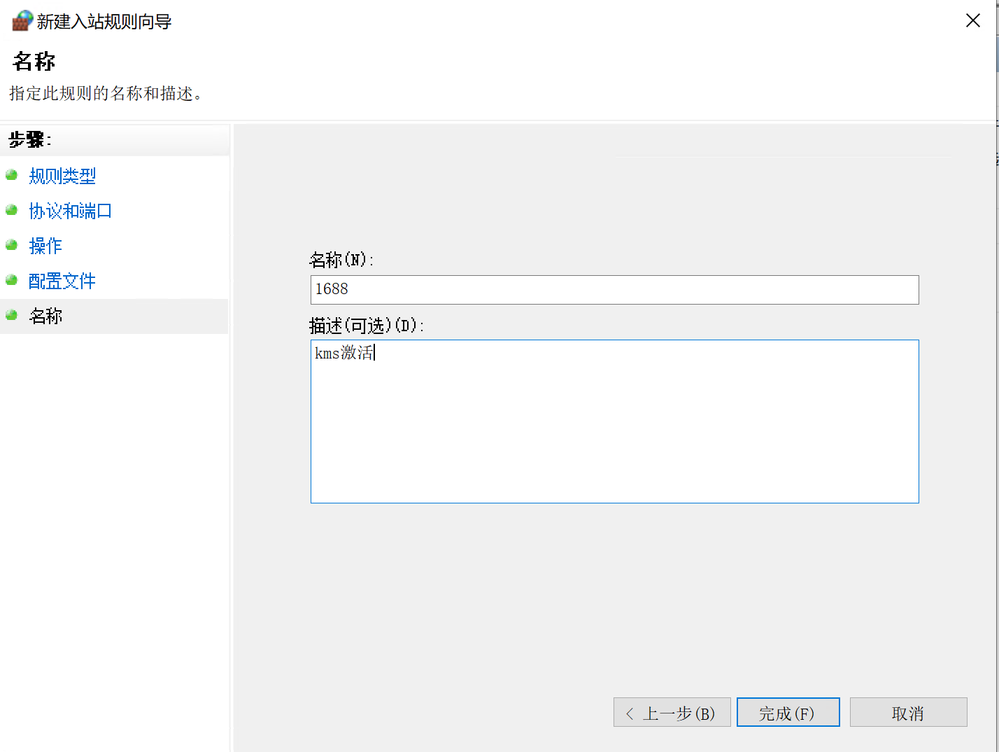
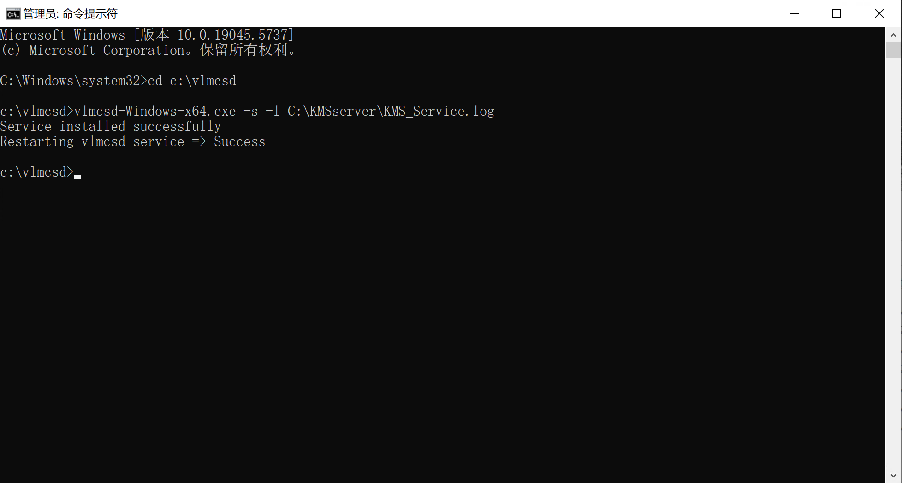
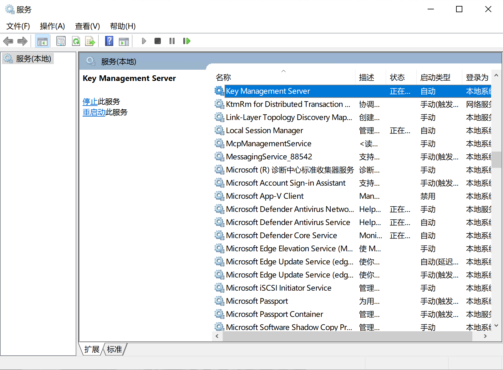

# 一、前言
[vlmcsd ](https://github.com/Wind4/vlmcsd)是一个开源的 KMS 激活服务器模拟器,主要用于在局域网环境下模拟微软官方的 Key Management Service，实现对 Windows 系统和 Office 套件的批量激活。它支持多平台部署（如 Windows、Linux、路由器等），广泛应用于测试、学习或部分企业内网激活场景，但如果用于未授权的激活行为，可能违反微软许可协议，存在法律风险。**本文档内容仅用于技术交流与学习研究，不提供或鼓励任何非法使用方式。**

# 二、服务器部署
1. 准备一台服务器 or 主机 or 虚拟机（配置要求不高，可根据自身情况调整）安装 Windows 10/11 or Windows server 2008 r2 已上版本系统。
2. 连接网络，设置好固定 IP 地址，防火墙放通 1688 端口或关闭防火墙。


3. 从 https://github.com/Wind4/vlmcsd/releases 下载 binaries.tar.gz 文件并解压出来。定位到 binaries.tar\binaries\binaries\Windows\intel，将 intel 目录下的所有文件解压到 C:\vlmcsd 文件夹（文件夹需要先创建，文件夹名字可自定义）
4. 以管理员身份打开命令提示符 CMD，cd 到 C:\vlmcsd 路径，运行下列命令：
```
vlmcsd-Windows-x64.exe -s -l C:\KMSserver\KMS_Service.log          // -s（小写）：安装 NT 服务，-S（大写）：删除 NT 服务，-l：指定输入运行日志；
```
如成功，则返回结果：service installed successfully。

5. 打开 services.msc，会发现多了一个名为 key management server 的服务。确保此服务启动并设置为自动运行。


# 三、客户端激活
在客户端新建一个文本文档，重命名为 kms.bat，编辑文档，输入一下内容。
```
cscript "%SystemRoot%\system32"\slmgr.vbs /skms 服务器IP地址
cscript "%SystemRoot%\system32"\slmgr.vbs /ato
cscript "%SystemRoot%\system32"\slmgr.vbs /xpr
paus
```

# 四、域内客户端自动激活
待更新